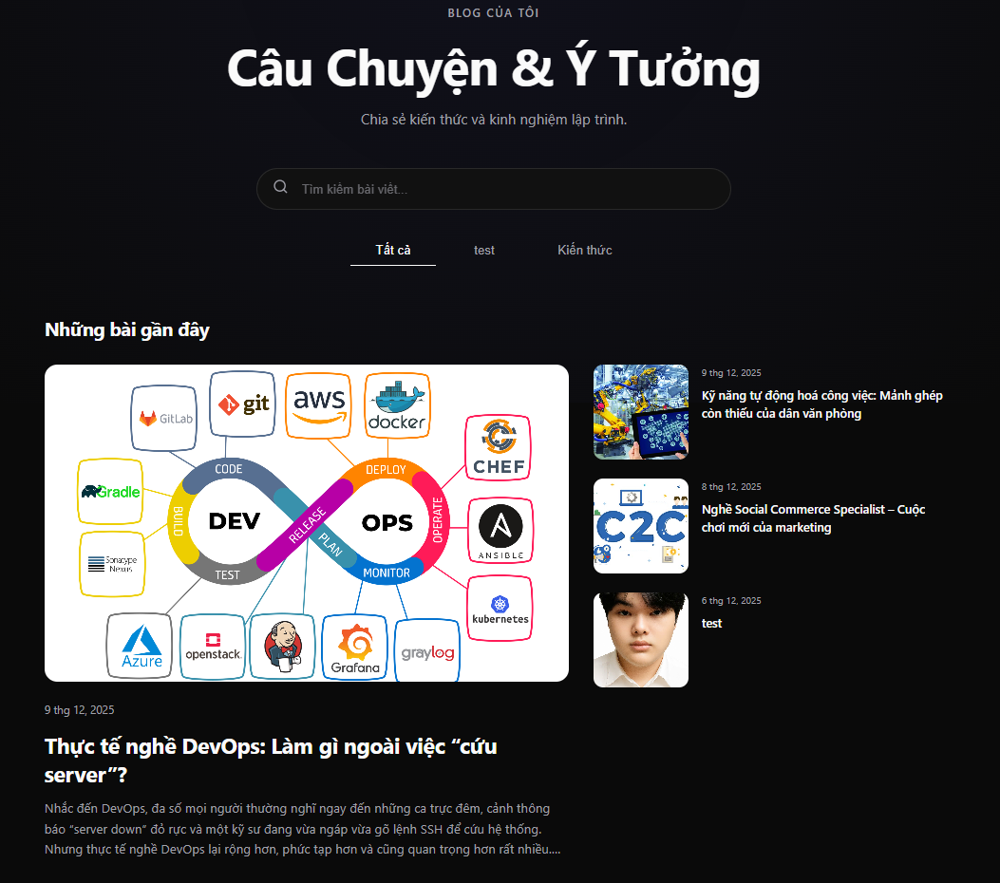
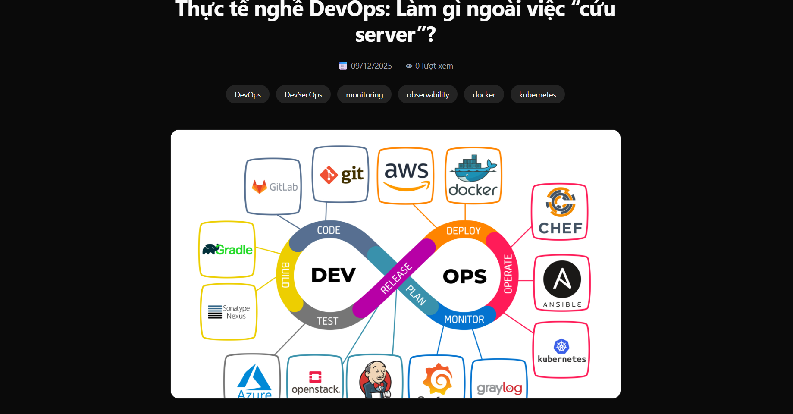
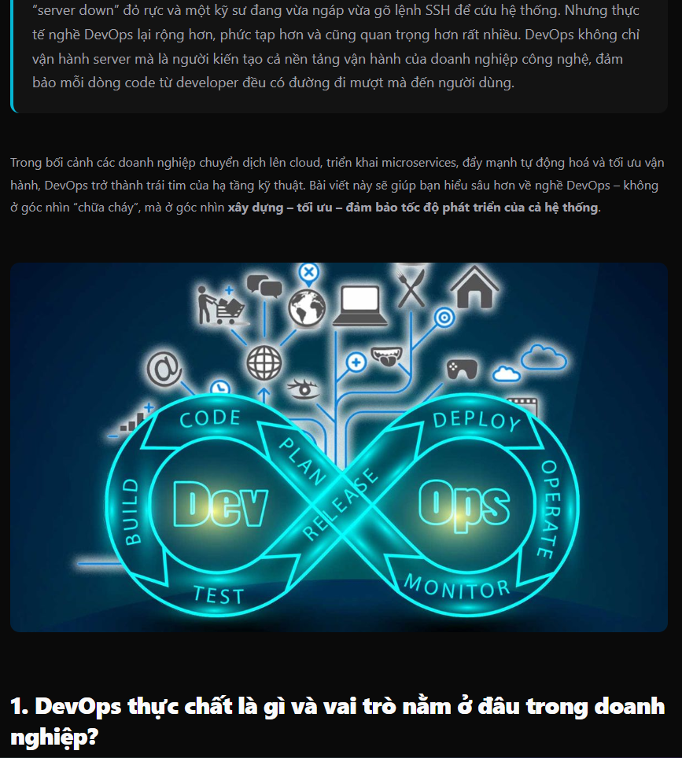
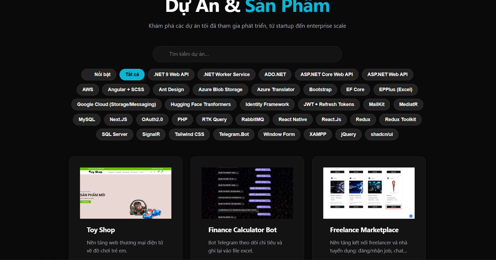
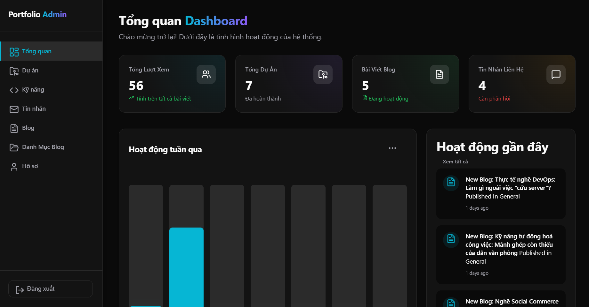
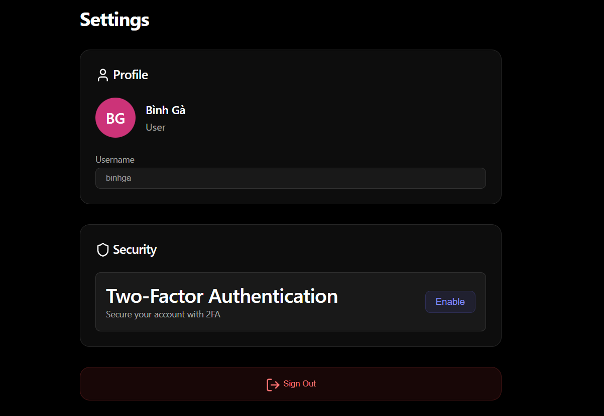

# Portfolio Project - Nhat Cuong

A full-stack personal portfolio application designed to showcase projects, blog posts, and programming skills. The system features a modern Frontend, a robust Backend, and integration with advanced technologies.

## Tech Stack

The project is built on a powerful and modern technology stack:

### Frontend
-   **Framework**: [Angular 19](https://angular.io/)
-   **Styling**: SCSS, Responsive Design
-   **Libraries**:
    -   RxJS (Reactive Programming)
    -   Lucide Angular (Icons)
    -   Quill (Rich Text Editor)
    -   Ngx Translate (Internationalization)

### Backend
-   **Framework**: [ASP.NET Core 8 Web API](https://dotnet.microsoft.com/en-us/apps/aspnet)
-   **Database**:
    -   SQL Server (Main Database)
    -   MongoDB (Logging/NoSQL storage)
-   **ORM**: Entity Framework Core
-   **Message Broker**: RabbitMQ
-   **Authentication**: JWT, Google/GitHub OAuth

### Infrastructure
-   **Containerization**: Docker, Docker Compose
-   **Tunneling**: Cloudflare Tunnel

---

## Features & Screenshots

### 1. Home Page
The main interface introducing the author and highlighted projects.


### 2. Blog List
A place to share knowledge and tech articles with search and filtering capabilities.


### 3. Blog Detail
Detailed article view supporting comments and interactions.




### 4. Projects List
Showcase of completed projects.


### 5. Admin Dashboard
Content management area for administrators.


### 6. Settings
Customize interface and personal information.


---

## Installation & Setup

### Prerequisites
Ensure you have the following tools installed:
-   [.NET 8 SDK](https://dotnet.microsoft.com/download/dotnet/8.0)
-   [Node.js](https://nodejs.org/) (v18 or later) & npm
-   [Docker Desktop](https://www.docker.com/products/docker-desktop) (Recommended for running Database & RabbitMQ)
-   [SQL Server](https://www.microsoft.com/en-us/sql-server/sql-server-downloads) (If running locally without Docker)

### 1. Backend Setup

1.  Navigate to the Backend directory:
    ```bash
    cd BE
    ```

2.  Configure Database connection in `appsettings.json` (If not using Docker).

3.  Run the application:
    ```bash
    dotnet restore
    dotnet build
    dotnet run --project BE_Portfolio
    ```
    The API will start at: `https://localhost:5001` (or the configured port).

### 2. Frontend Setup

1.  Navigate to the Frontend directory:
    ```bash
    cd fe
    ```

2.  Install dependencies:
    ```bash
    npm install
    # or
    yarn install
    ```

3.  Run the development server:
    ```bash
    npm start
    # or
    ng serve
    ```
    Access the application at: `http://localhost:4200`

### 3. Run with Docker Compose (Recommended)

If you want to run the entire system (Database, RabbitMQ, API) using Docker:

1.  At the root directory (containing `compose.yaml`):
    ```bash
    docker-compose up -d
    ```

2.  The system will automatically initialize the necessary services.

---

## License

This project is licensed under the MIT License. See the LICENSE file for details.
